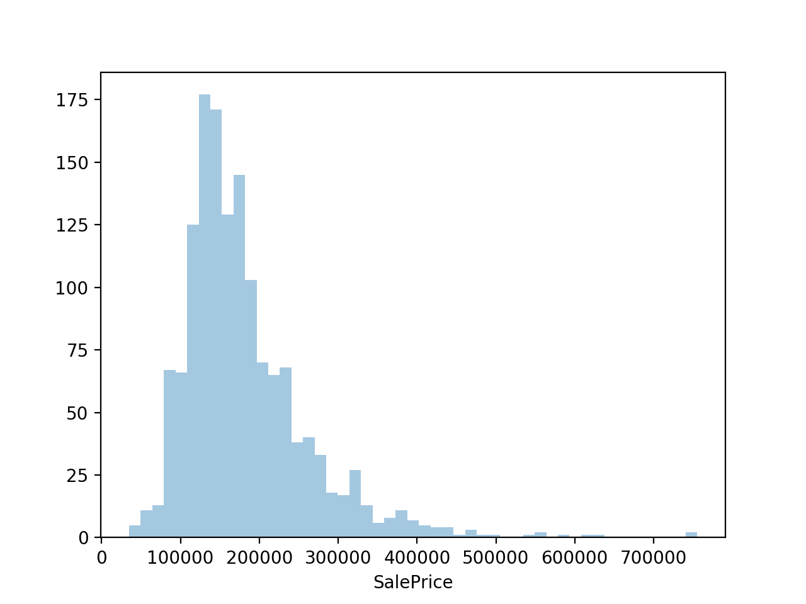
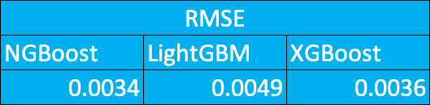
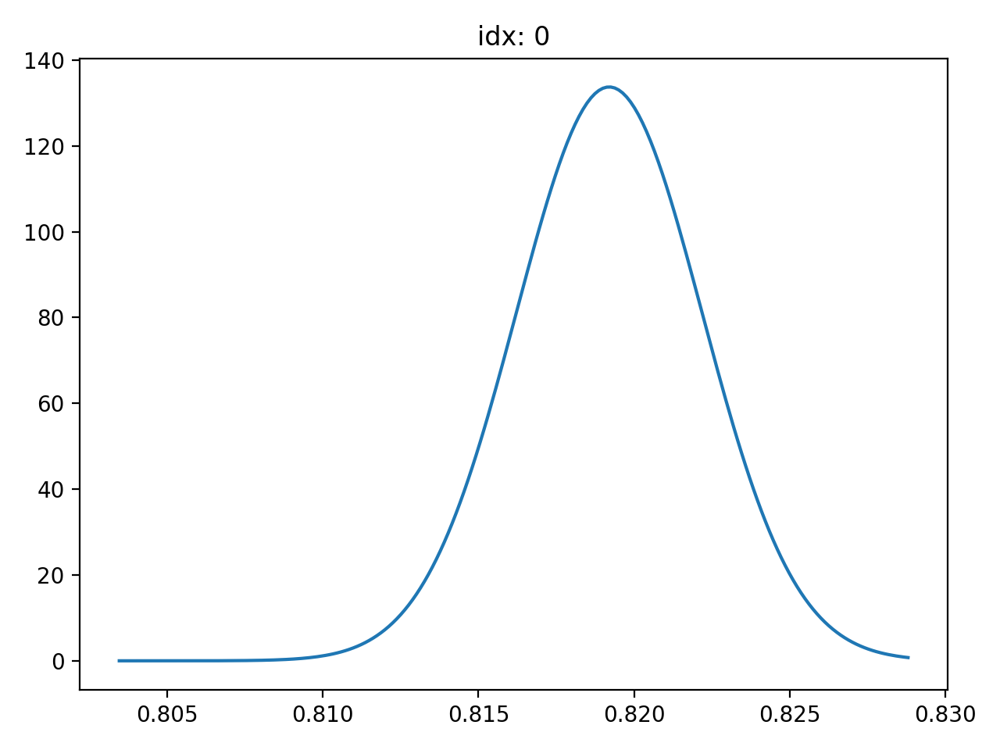
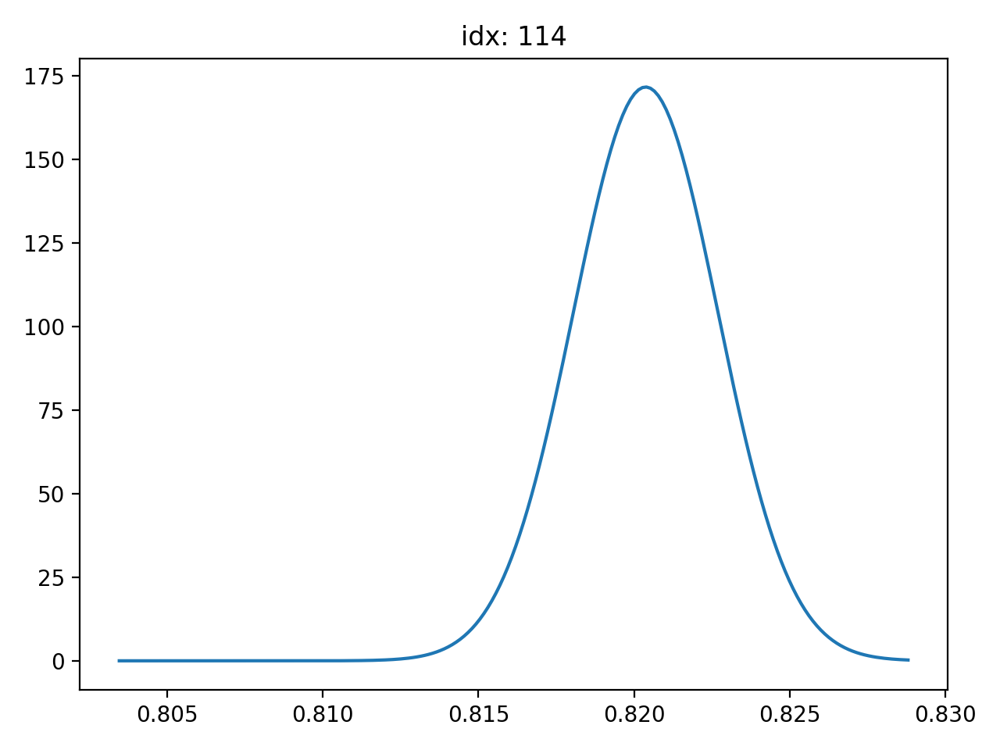

# NGBoost-experiments
This repository was created for playing around with NGBoost and comparing its performance with LightGBM and XGBoost. The results are summarised in my [medium blog post](https://towardsdatascience.com/ngboost-explained-comparison-to-lightgbm-and-xgboost-fda510903e53).

## Table of contents
* [General info](#general-info)
* [Requirements](#Requirements)
* [Setup](#setup)
* [Results](#results)
* [Reference](#Reference)

## General info
Stanford ML Group recently published a new algorithm in their paper, [1] Duan et al., 2019 and its implementation called NGBoost. This algorithm includes uncertainty estimation into the gradient boosting by using the Natural gradient. This post tries to understand this new algorithm and comparing with other popular boosting algorithms, LightGBM and XGboost to see how it works in practice.
This repository 

## Requirements
```
lightgbm == 2.2.3
ngboost == 0.1.3
numpy == 1.15.4
pandas == 0.23.4
scikit_learn == 0.21.3
scipy == 1.3.1
xgboost == 0.90
```

## Setup
I would like to show the model performance on the famous [house price prediction dataset](https://www.kaggle.com/c/house-prices-advanced-regression-techniques/data) on Kaggle. This dataset consists of 81 features, 1460 rows and the target feature is the sale price. Let’s see NGBoost can handle these conditions. Below is the plot of sale price distribution.


## Results


NGBoost outperformed other famous boosting algorithms. I feel like if I tune the parameters well, NGBoost's performance will be even better.

NGBoost’s one of the biggest difference from other boosting algorithms is can return probabilistic distribution of each prediction instead of "point" predictions. Here are two examples.



## Reference
[1] [T. Duan, et al., NGBoost: Natural Gradient Boosting for Probabilistic Prediction (2019), ArXiv 1910.03225](https://www.semanticscholar.org/paper/NGBoost%3A-Natural-Gradient-Boosting-for-Prediction-Duan-Avati/3b432eea984904c926e2d6cc4dc2b70753499ca5)
